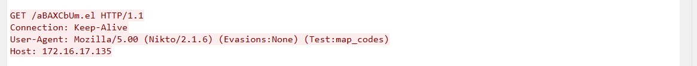

## How to solve

Desc: They've been trying to breach our infrastructure all morning! They're trying to get more info on our covert kangaroos! We need your help, we've captured some traffic of them attacking us, can you tell us what tool they were using and its version?

NOTE: Wrap your answer in the DUCTF{}, e.g. DUCTF{nmap_7.25}

1. Open the pcap file using wire shark

2. Sort the packet capture using protocol

3. Follow the TCP Stream

4. 

5. Im pretty sure the attacker is in the picture since them try to GET request many times with suspicious path like "/aBAXCbUm.iso8859-2"

6. The tools is Nikto version 2.1.6

7. DUCTF{Nikto_2.1.6}