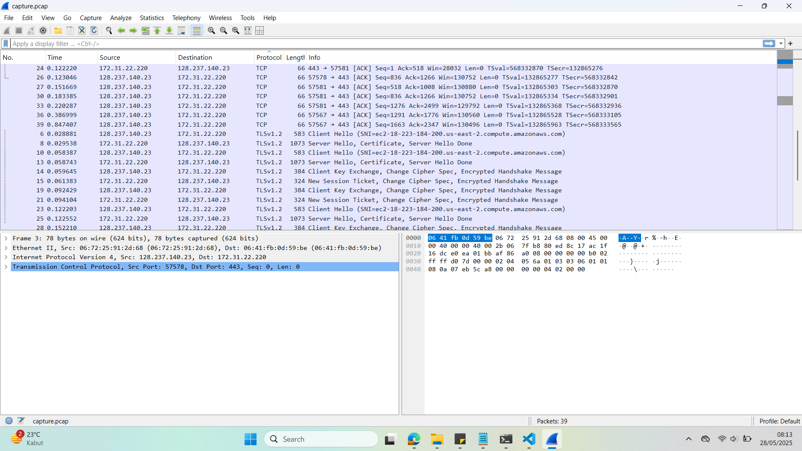
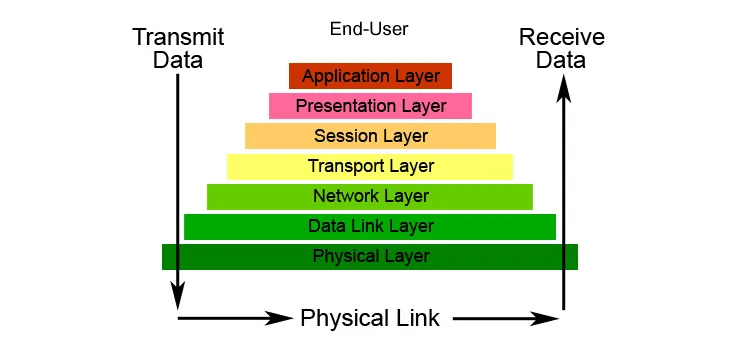
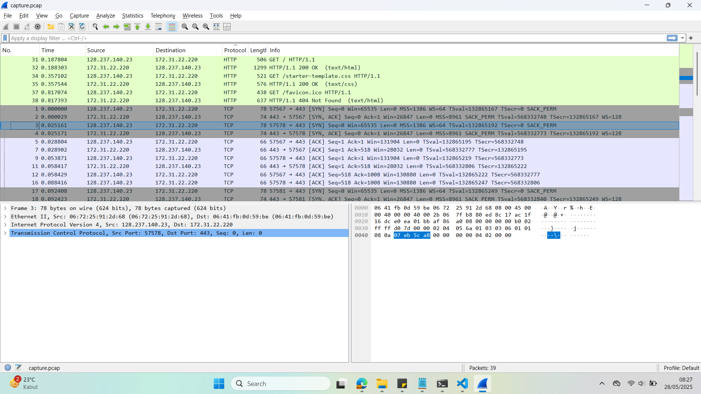
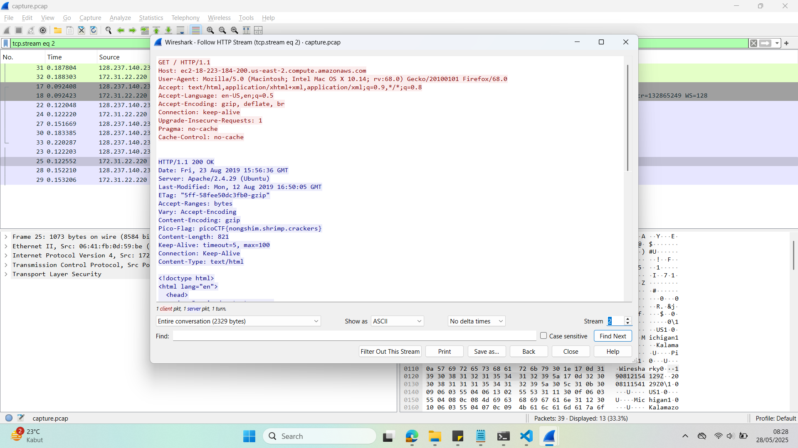

## How to solve

Desc: We found this packet capture and key. Recover the flag.

Hint 1: Try using a tool like Wireshark.

Hint 2: How can you decrypt the TLS stream?

1. Open the packet capture using wireshark

2. 

3. Dapat kita lihat bahwa terdapat 2 protocol yaitu TCP dan TLS

4. Jika kita lihat di hint 2 kita diminta untuk mengetahui bagaimana ngedecrypt protocol TLS stream

5. Kalo kita lihat dari definisi, A TLS stream refers to a secure data stream that uses TLS (Transport Layer Security) to encrypt the communication between two endpoints—typically between a client and a server.

6. 

7. Jadi TLS Protocol stream adalah komunikasi antara client dan server yang dienkripsi

8. Kalo dilihat dari file yang diberikan challenge, sepertinya key-nya itu key enkripsi dari TLS Stream

9. Kita bisa dengan mudah cari gimana ngedecrypt TLS Stream pake key

10. https://blog.didierstevens.com/2020/12/14/decrypting-tls-streams-with-wireshark-part-1/

11. Kita bisa memasukan key yang dikasih di Edit > Preferences > Protocols > TLS > Edit > RSA Key List

12. Setelah kita masukan keynya, new stream with HTTP protocol muncul

13. 

14. Jika kita follow stream HTTP protocol, kita dapat dengan mudah melihat flagsnya

15. 