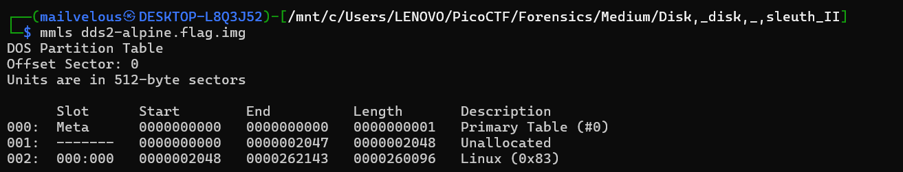
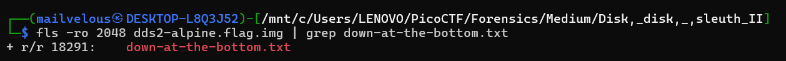
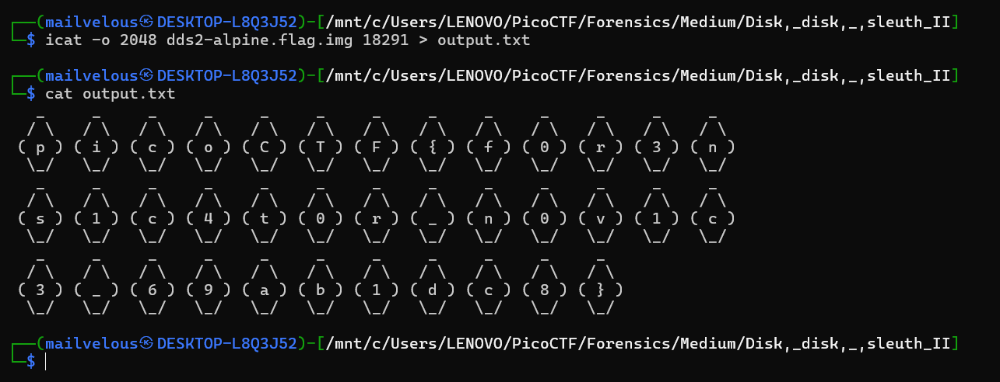

## How to solve

Desc:   All we know is the file with the flag is named `down-at-the-bottom.txt`... Disk image: dds2-alpine.flag.img.gz

Hint 1: The sleuthkit has some great tools for this challenge as well.

Hint 2: Sleuthkit docs here are so helpful: TSK Tool Overview

Hint 3: This disk can also be booted with qemu!

1. Extract dds2-alpine.flag.img.gz using gunzip

2. After that lets see the multimedia layers using mmls

3. 

4. As you can see, there is one offset, 2048

5. Lets see the files using 'fls -ro 2048 dds2-alpine.flag.img'

6. The descriptions tell us, the flag is in the txt file names 'down-at-the-bottom.txt'

7. Lets search using grep

8. 

9. In the inode 18291

10. To open the txt file, we cannoct just cat them

11. We have to point the inode address

12. We can use icat from sleuthkit point the inode address and copy them to the new txt 'icat -o 2048 dds2-alpine.flag.img 18291 > output.txt'

13. Cat the txt

14. 