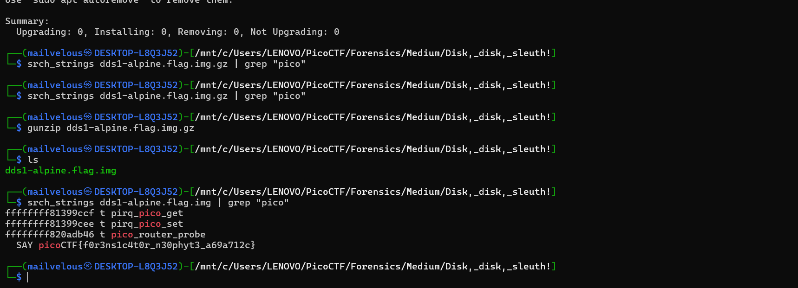

## How to solve

1. Use srch_strings from sleuthkit 

```bash

srch_strings dds1-alpine.flag.img.gz 

```

2. Then try to get the picoCTF flag using grep.

```bash

srch_strings dds1-alpine.flag.img.gz | grep "pico"

```

3. But u cannot use grep and srch_strings since the disk is .gz format

4. So try to decompress from .gz to .img using gunzip 

```bash

gunzip dds1-alpine.flag.img.gz

```

5. And then 

```bash

srch_strings dds1-alpine.flag.img | grep "pico"

```




picoCTF{f0r3ns1c4t0r_n30phyt3_a69a712c}
    