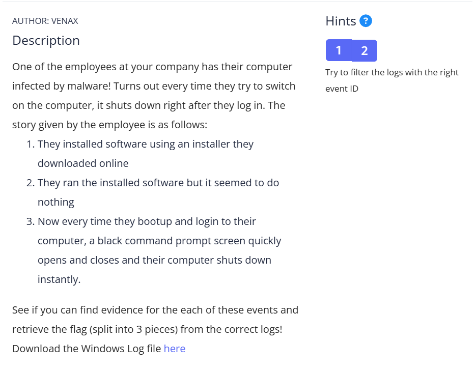

## How to solve

1. We have clue that flags are separated by 3 stories, and filtering logs events with event id can be helpful

2. So the first events is about installing software

3. I try to find which Event ID yang menangani install software

4. Then i found this  with 1033 Event ID

5. This software is suspicious because of the manufacturer.

6. Then decode "cGljb0NURntFdjNudF92aTN3djNyXw==" base64

7. picoCTF{Ev3nt_vi3w3r_} we found the first part

8. So, this challenge also about "persistence" which is cara yg digunain malware/hacker buat tetep ada dalem sistem

9. Dan ternyata ini berhubungan sama registry keys

10. If we search about persistence in Event ID 

11. Then i found this 

12. The application name is same as before "Totally_Legit_Software.exe"

13. Registry location is "HKLM\...\Run" which is classic persistence location, dan akan dijalankan saat Windows boot

14. decode "MXNfYV9wcjN0dHlfdXMzZnVsXw==" base64

15. 1s_a_pr3tty_us3ful_ the ssecond part

16. We can search what event id triggered shutdown 

17. 

18.  Finally we found the last part

19. decode "dDAwbF84MWJhM2ZlOX0=" base64

20. t00l_81ba3fe9}

picoCTF{Ev3nt_vi3wv3r_1s_a_pr3tty_us3ful_t00l_81ba3fe9}