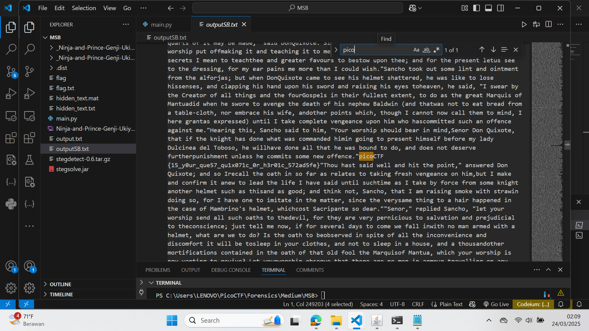

## How to solve

1.  First let see the image 

2.  Then i try to find what is the MSB and LSB is...

3.  Jadi simpelnya MSB is Most Significant Bits atau bit paling kiri
    Kalo di image atau steganography MSB tuh paling berpengaruh, dan kalo diubah tuh
    pasti langsung kelihatan mata kayak bakal jadi sebab buat
    gambar kelihatan distorsi/error/corrupt(gambar diatas).

4.  Nah kalo LSB sebaliknya, dia bit paling kanan
    Kalo di image atau steganography ga terlalu berpengaruh, dan biasanya 
    LSB ini yang sering dipake dalam steganography, biasanya buat nyisipin data
    karena LSB ini cuma ngubah image dikit banget kayak warna, kecerahan dll.

5.  Buat soal ini aku coba beberapa cara buat ekstraksi MSB LSB dalam gambar.
    AKu tadi coba tools kayak zsteg, stegdetect, dll.

6.  Tapi aku nemu repo github buat significant bits. Ini linknya [text](https://github.com/Pulho/sigBits)

7.  Disitu udah ada examplesnya, tinggal kita pake

```bash

python main.py -t=msb Ninja-and-Prince-Genji-Ukiyoe-Utagawa-Kunisada.flag.png

```

8.  Dapet hasilnya 

9.  Dan tinggal kita cari "pico"


picoCTF{15_y0ur_que57_qu1x071c_0r_h3r01c_572ad5fe}
    