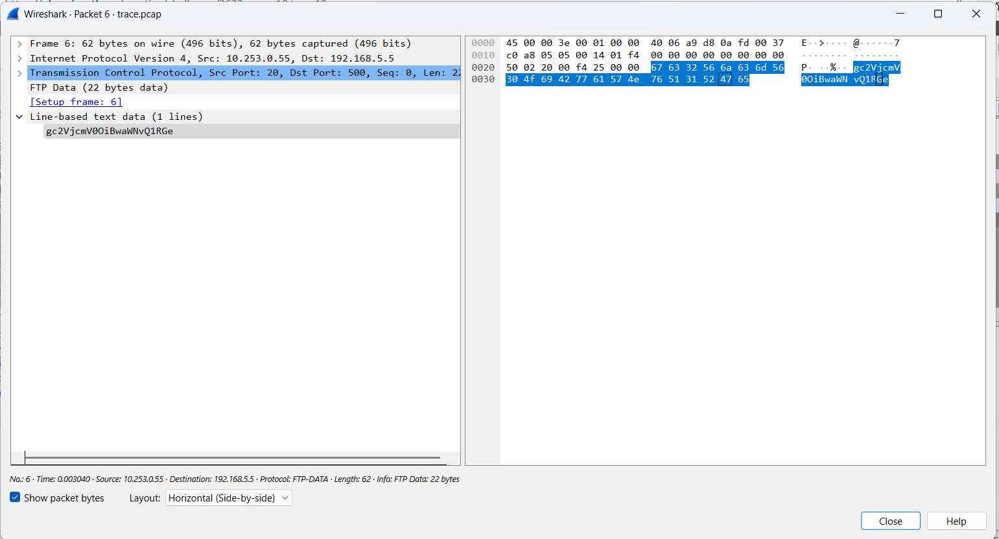
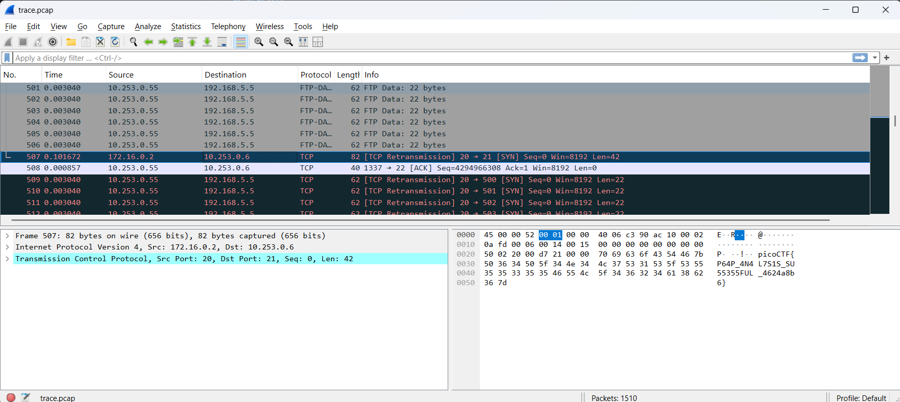
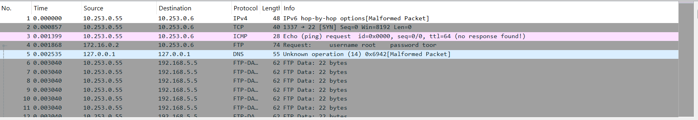
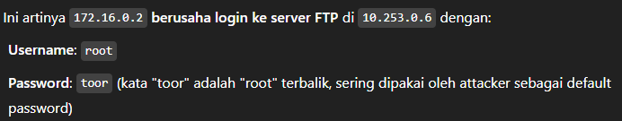
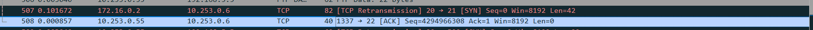
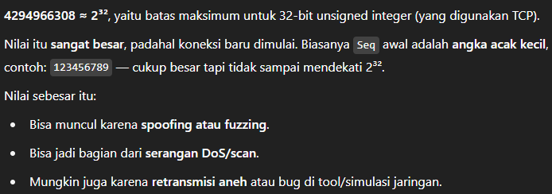

## How to solve

1. Open pcap file using wireshark

2. Kalo kita lihat source dengan IP 10.253.0.55 mencoba mengirimkan data menggunakan FTP protocol

3. Data tersebut dapat kita lihat berupa text data 

4. "gc2VjcmV0OiBwaWNvQ1RGe", merupakan base64 dan jika kita decode maka hasilnya "picoCTF"

5. Jika kita telusuri terus maka pada no.507 source dengan IP 172.16.0.2 dan destination 10.253.0.6 mencoba TCP transmission 

6. Sebenernya udah ada flagnya, namun jika kita kembali ke atas

7. 

8. Ada IP asing 172.16.0.2 yang mencoba masuk dengan root:toor 

9. 

10. Jadi mungkin intinya ada IP 172.16.0.2(asing) yang mencoba mnyisipkan sesuatu

11. Juga pada 

12. Teradapat nilai seq yang sangat besar 

    