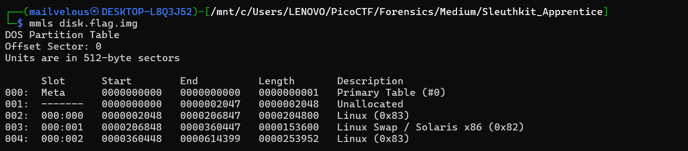
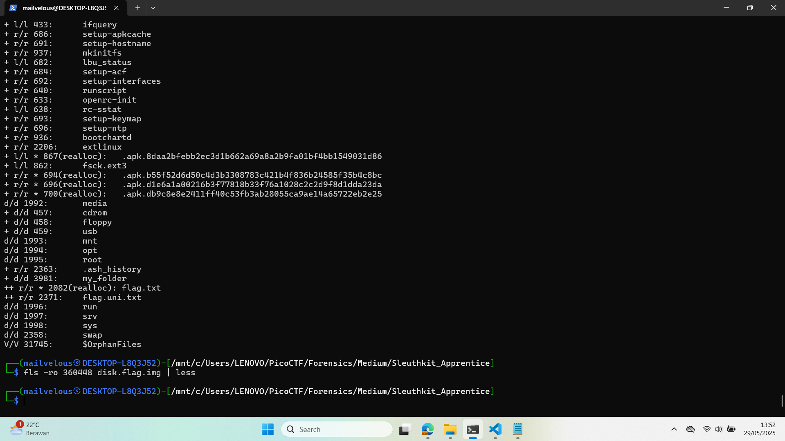
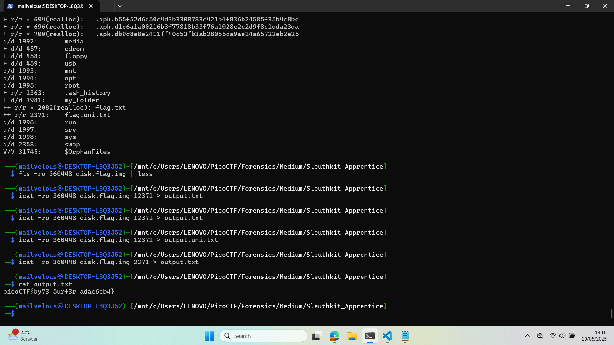

## How to solve

Desc:   Download this disk image and find the flag.
        Note: if you are using the webshell, download and extract the disk image into /tmp not your home directory.
        Download compressed disk image

Hints : (None)

1. Extract disk.flag.img.gz using gunzip

2. Take a look at multimedia layers using mmls

3. 

4. Dapat kita lihat bersama bahwa terdapat beberapa offset: 2048, 206848, 360448 

5. Kita dapat coba lihat isinya satu satu melalui 'fls -o offset disk.flag.img'

6. Dalam offset 360448 terdapat flag.txt

7. 

8. Oh iya kita tidak dapat mengambil/copy ++ r/r * 2082(realloc): flag.txt karena sleuthkit tidak dapat heap allocation

9. Oleh karena itu kita coba ambil yang ++ r/r 2371:    flag.uni.txt

10. 'icat -ro 360448 disk.flag.img 2371 > output.txt'

11. 

