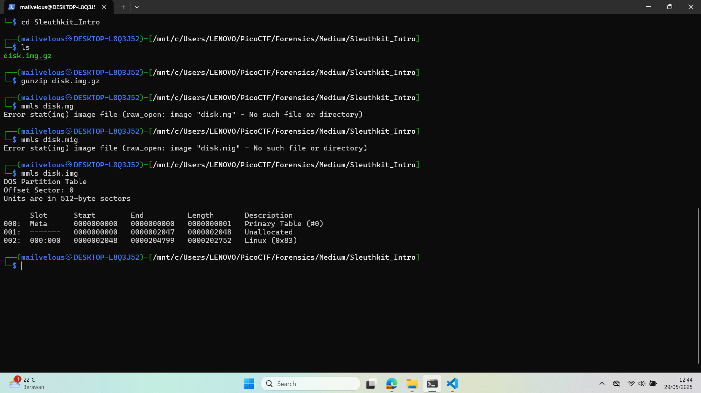
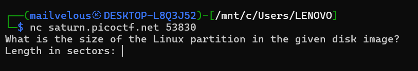

## How to solve

Desc:   Download the disk image and use mmls on it to find the size of the Linux partition. Connect to the remote checker service to check your answer and get the flag.
        Note: if you are using the webshell, download and extract the disk image into /tmp not your home directory.
        Download disk image
        Access checker program: nc saturn.picoctf.net 51553

Hint 1: (None)

1. Open the directory disk.img.gz

2. To extract lets gunzip them 'gunzip disk.img.gz'

3. Sebelumnya yang perlu kita tahu adalah .img tuh punya bbeberapa layer data 

4.      ┌────────────────────────────┐
        │     Disk Image (.img)      │  ← file image tunggal (bitstream)
        └────────────────────────────┘
                    │
                    ▼
        ┌────────────────────────────┐
        │    Partition Table (MBR/GPT)│  ← struktur partisi (dilihat dg `mmls`), multi media layers
        └────────────────────────────┘
                    │
                    ▼
        ┌────────────────────────────┐
        │     Partisi (Linux, NTFS)  │  ← tiap partisi punya offset berbeda
        └────────────────────────────┘
                    │
                    ▼
        ┌────────────────────────────┐
        │     File System (ext4, etc)│  ← dilihat dg `fsstat`, `fls`, `icat`
        └────────────────────────────┘
                    │
                    ▼
        ┌────────────────────────────┐
        │     File & Folder Metadata │  ← inode, FAT table, direktori
        └────────────────────────────┘
                    │
                    ▼
        ┌────────────────────────────┐
        │        File Content        │  ← isi file sebenarnya
        └────────────────────────────┘

5. Mari kita lihat dalam multi media layers atau layer terluar dahulu dengan mmls

6. 

7. Kita coba connect ke checker program

8. 

9. Kita diminta untuk menginputkan length sector linux,  0000202752

10. picoCTF{mm15_f7w!}