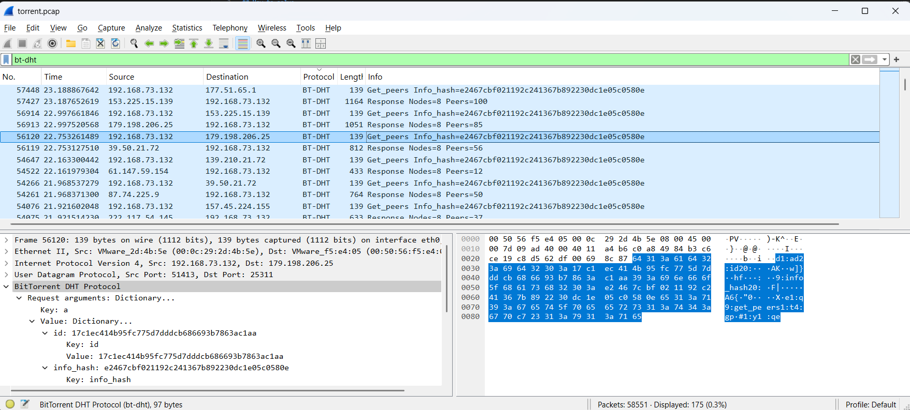
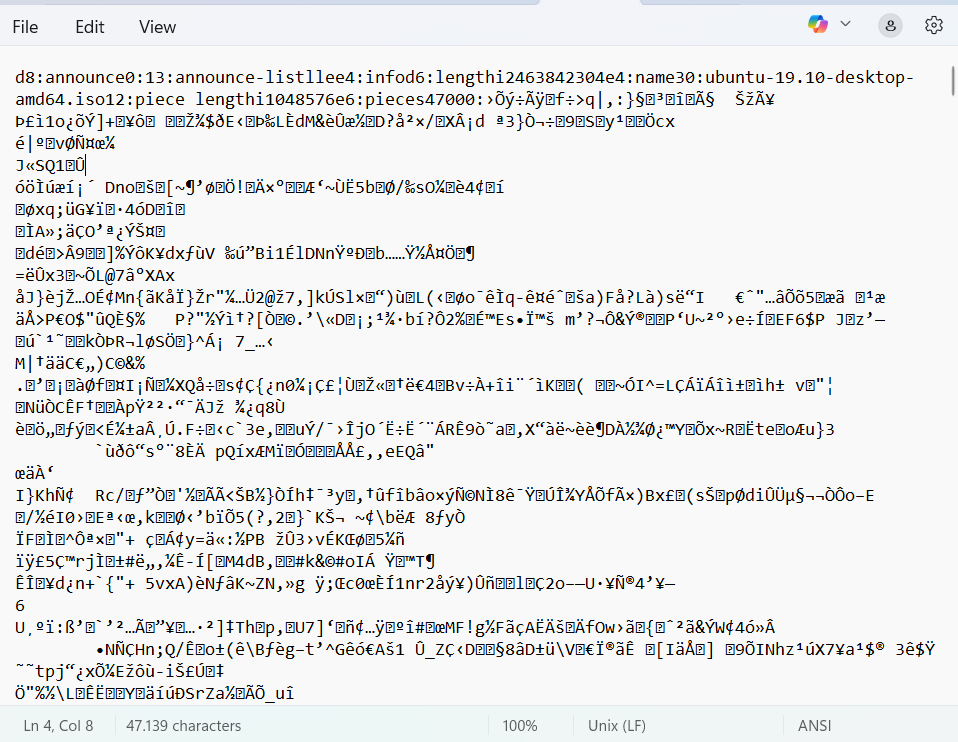

## How to solve

1. Open pcap file using wireshark

2. Karena di hint "You may want to enable BitTorrent protocol (BT-DHT, etc.) on Wireshark. Analyze -> Enabled Protocols", jadi mending langsung apply filter protocol bt-dht aja

3. Di 3 juga disebutkan kita perlu memahami peers, leechers, seeds.

4. Intinya seeds itu sumber datanya dan seeds bisa banyak, makin banyak makin baik

5. Leechers itu pendownload file, tetapi mereka juga sekaligus pengunggah walaupaun lebih banyak porsi buat downoad

6. Peers itu semua yang terhubung di torrent baik seeds maupun leechers

7. Kalo kita lihat di packet capturenya setelah difilter bt-dht di wireshark

    

8. Terdapat peers dengan info_hash nya

9. Karena hash pada torrent pasti unik maka kita bisa langsung cari file dengan hash tersebut

10. Kita bisa cari file lewat hash torrent melalui https://hash2torrent.com/

11. Karena di challengenya kita disuruh input picoCTF{filename} dan filenya berbentuk .iso

12. Maka 