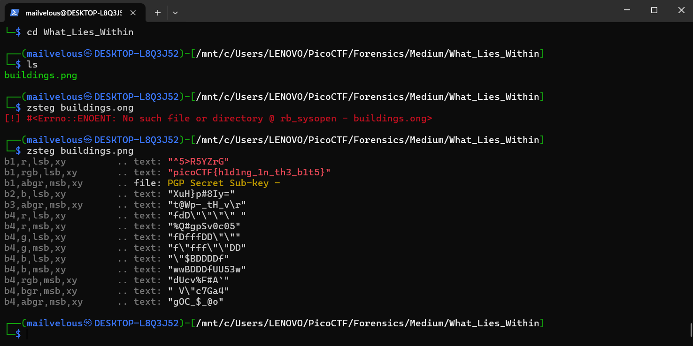

## How to solve

Desc:   There's something in the building. Can you retrieve the flag?

Hints 1: There is data encoded somewhere... there might be an online decoder.

1. Karena ini extensinya png maka kita langsung saja gunakan tools untuk png, yaitu zsteg

2. 'zsteg buildings.png'

3. 
