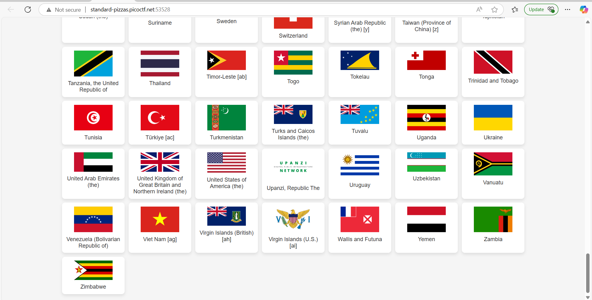
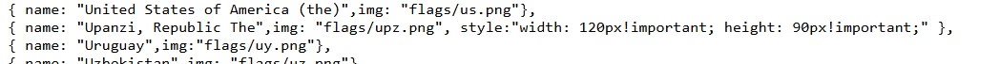
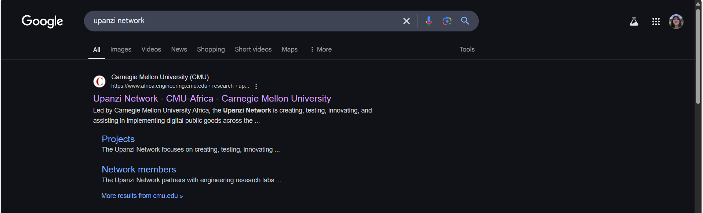

## How to solve

1. If we scroll the entire website, there is flag that not country, Upanzi

2. Kalo kita lihat source pagenya juga Upanzi tuh kayak beda sendiri ada tambahan css 

3. Download the image

4. I try to cat, strings, binwalk, etc. But ga dapet apa apa.

5. If we search "upanzi network" 

6. If we search "stepic" on google there is 2 atau lebih definisi!. Kayaknya yg steganography stepic itu yg bener
[alt text](image-2.png)

7. So actually python have library for that.

8. Jadi saya hanya tinggal pake librarynya dan decode image.

9. You can see the tutorial/documentation here atau tanya AI

10. [text](https://pypi.org/project/stepic/)

11. 

