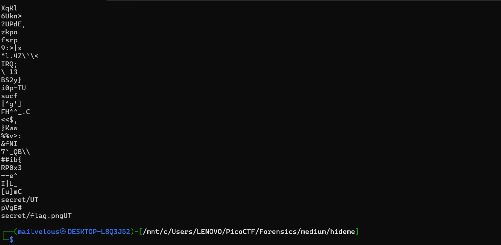
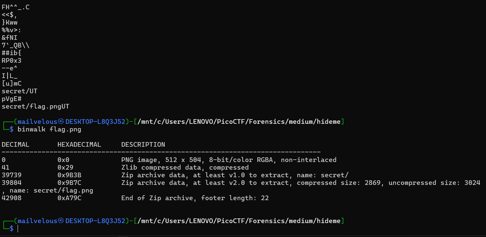
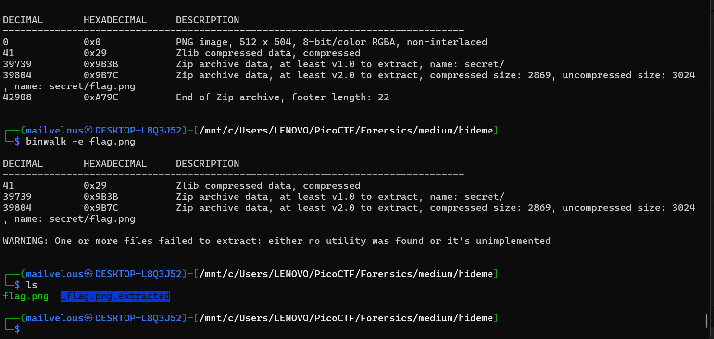

## How to solve

1. First i will try to open the image using cat or strings
```bash

cat flag.png

```
```bash

strings flag.png

```

2. As you can see, there is flag.png inside secret directory "secret/flag.png"



3. Lets try to binwalk

4. There is zip archive data /secret.

5. Lets extract them.

6. The real flag are inside them.


    