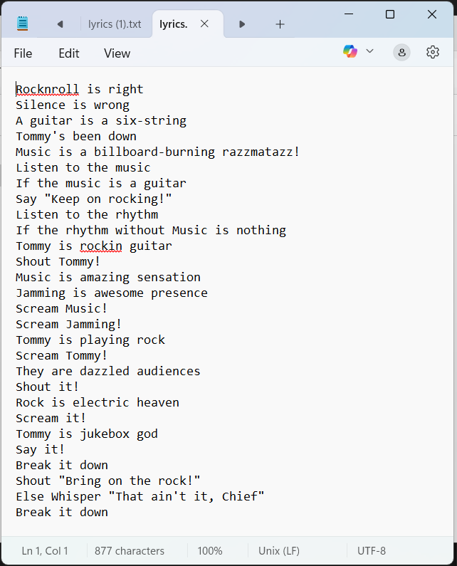
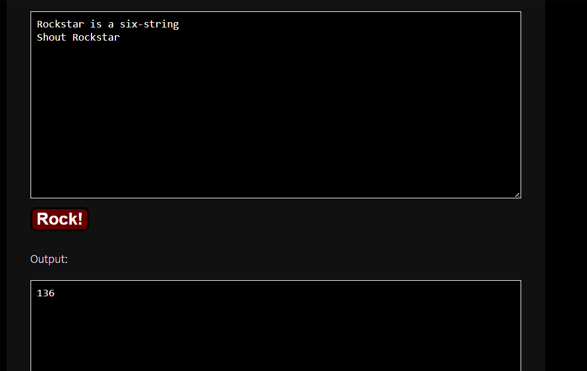
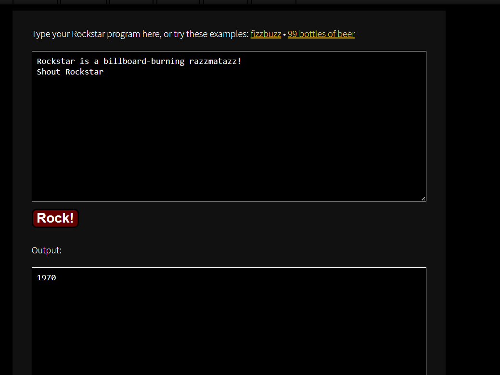
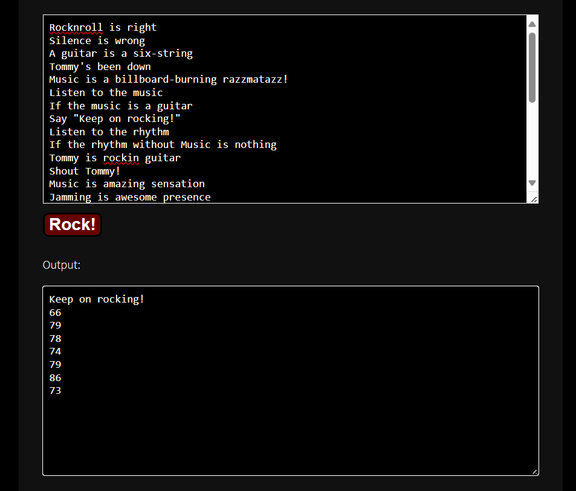

## How to solve

1. Let see the txt/lyrics

2. 

3. The challenge also give the website for intrepet the lyrics

4. So, word "a, an, the, my, your" is for declare a variable
            "right, yes, ok" is for true
            "wrong, no, lies" is for wrong
            "is, are, was, were" for assign a value to variable
            "listen", is for input
            "shout, say, whisper, scream", is for output

5. "Rocknroll is right              
    Silence is wrong                
    A guitar is a six-string        
    Tommy's been down               
    Music is a billboard-burning razzmatazz!
    Listen to the music             
    If the music is a guitar                  
    Say "Keep on rocking!"   

    Means we declare a variable music, and we read input from keyboard
    If music is a guitar which is guitar is six-string, the program will say/output "Keep on rocking!"

6. "six-string" is 136

7. Lets see another if-statement
    "Listen to the rhythm
    If the rhythm without Music is nothing
    Tommy is rockin guitar
    Shout Tommy!                    
    Music is amazing sensation 
    Jamming is awesome presence
    Scream Music!                   
    Scream Jamming!
    ..."

    Means we declare variable rhythm and then read input from keyboard
    If (rhythm - Music) == nothing *without is substraction, nothing is 0
    Do ...

8. So if false program will skip the next line

9. "Music" is 

10. So if we input 1970 it means rhythm - Music == 0. 

11. 
    "66
    79
    78
    74
    79
    86
    73"

12. Always check the ASCII

66  → B  
79  → O  
78  → N  
74  → J  
79  → O  
86  → V  
73  → I  

picoCTF{BONJOVI}
    