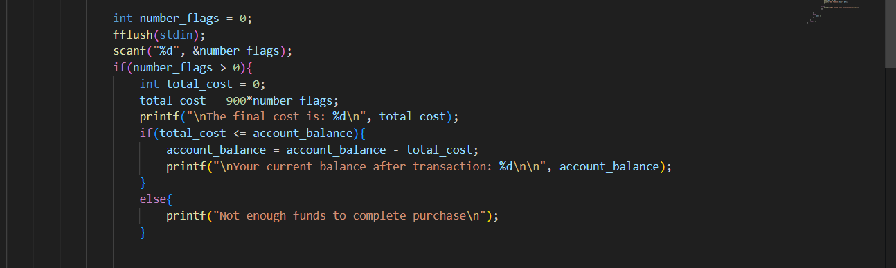
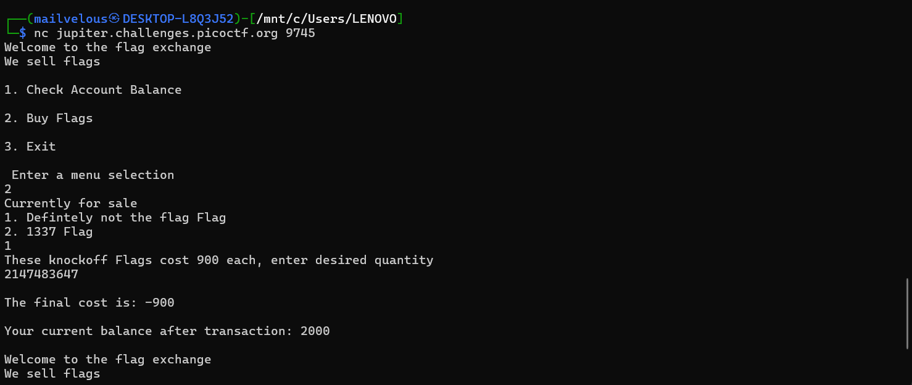
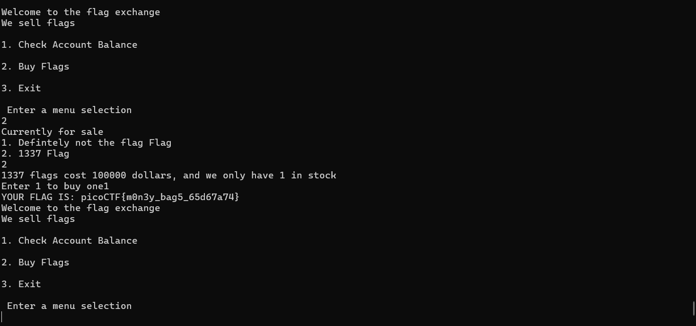

## How to solve

1. Im pretty sure this challenge is about max value for data types

2. Since this challenge use int as a data types 

3. Lets input maximum value of integer in c, which is 2147483647

4. Lets input this 

5. We can continue do this until the balance reach the price of real flag

6. 

picoCTF{m0n3y_bag5_65d67a74}
    