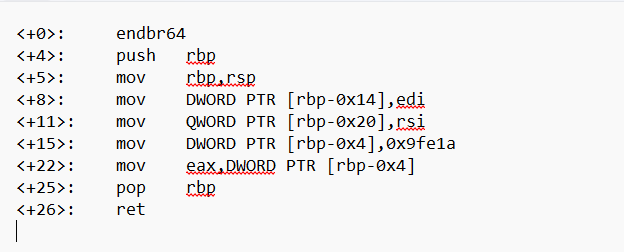

## How to solve

1. Challengenya nyuruh kita untuk cari tahu apa yang ada di register eax

2. 

3. Format dalam assembly: instructions/mnemonik tujuan, sumber

4.  <+15>:    mov    DWORD PTR [rbp-0x4], 0x9fe1a, menyimpan nilai 0x9fe1a ke pointer DWORD PTR [rbp-0x4]
    <+22>:    mov    eax,DWORD PTR [rbp-0x4], ini berarti register eax menyimpan 0x9fe1a

5. 654874

