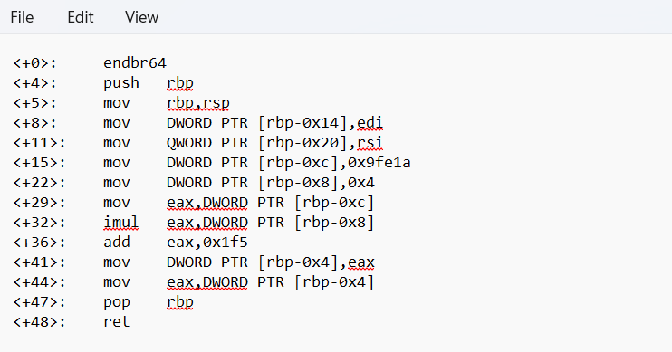

## How to solve

1. 

2. <+15>:    mov    DWORD PTR [rbp-0xc],0x9fe1a -> simpan 0x9fe1a ke DWORD PTR [rbp-0xc]
    <+22>:    mov    DWORD PTR [rbp-0x8],0x4 -> simpan 0x4 ke DWORD PTR [rbp-0x8]
    <+29>:    mov    eax,DWORD PTR [rbp-0xc] -> simpan nilai DWORD PTR [rbp-0xc] ke register eax
    <+32>:    imul   eax,DWORD PTR [rbp-0x8] -> imul(multiplication), itu berarti nilai register eax yang sekarang dikali/multiple sama DWORD PTR [rbp-0x8]
    <+36>:    add    eax,0x1f5 -> add/tambah, tambah 0x1f5 ke register eax
    <+41>:    mov    DWORD PTR [rbp-0x4],eax
    <+44>:    mov    eax,DWORD PTR [rbp-0x4]

3. register eax = 0x9fe1a * 0x4 + 0x1f5

4. 654874 x 4 + 501