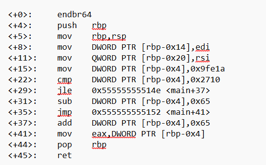

## How to solve

1. 

2.  <+15>:    mov    DWORD PTR [rbp-0x4],0x9fe1a -> menyimpan nilai 0x9fe1a ke pointer DWORD PTR [rbp-0x4]
    <+22>:    cmp    DWORD PTR [rbp-0x4],0x2710 -> cmp(compare), compare nilai DWORD PTR [rbp-0x4] dengan 0x2710
    <+29>:    jle    0x55555555514e <main+37> -> jle, jump if less or equal, artinya jika DWORD PTR [rbp-0x4] =< 0x2710 maka akan lompat ke <main+37>
                                                tapi tidak akan terjadi, jadi tidak lompat ke <main+37>
    <+31>:    sub    DWORD PTR [rbp-0x4],0x65 -> sub(substract), kurangi nilai pointer DWORD PTR [rbp-0x4] dengan 0x65
    <+35>:    jmp    0x555555555152 <main+41> -> jump ke <main+41>
    <+37>:    add    DWORD PTR [rbp-0x4],0x65 -> dilewati
    <+41>:    mov    eax,DWORD PTR [rbp-0x4] 

3. 0x9fe1a - 0x65
