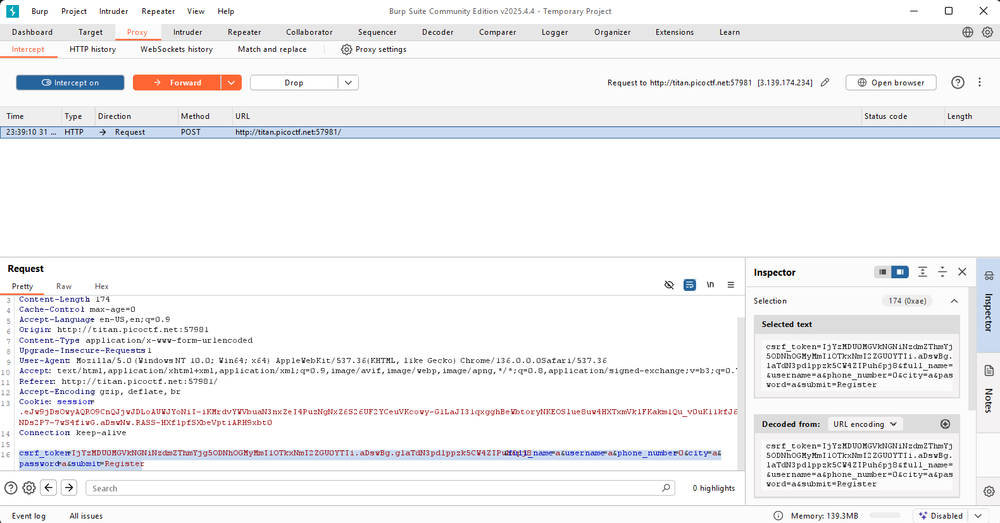
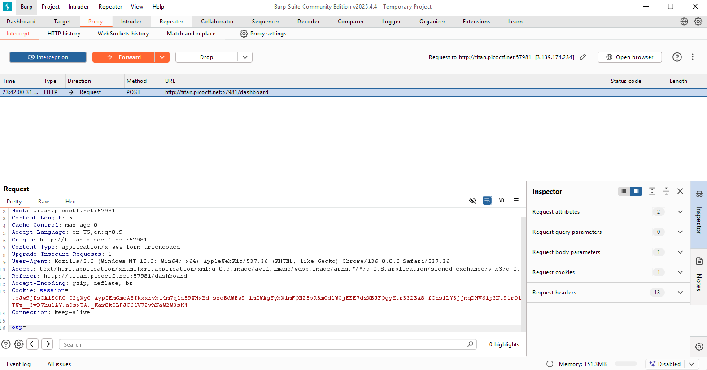
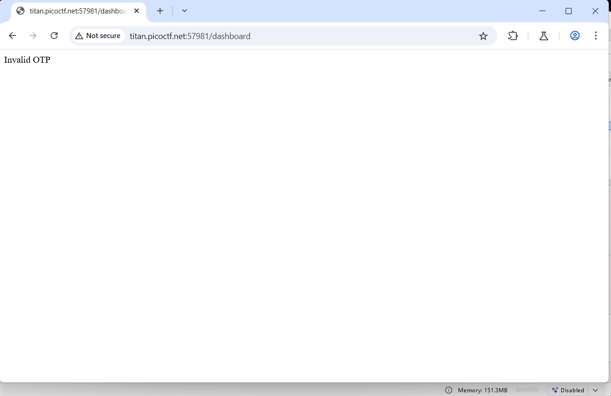
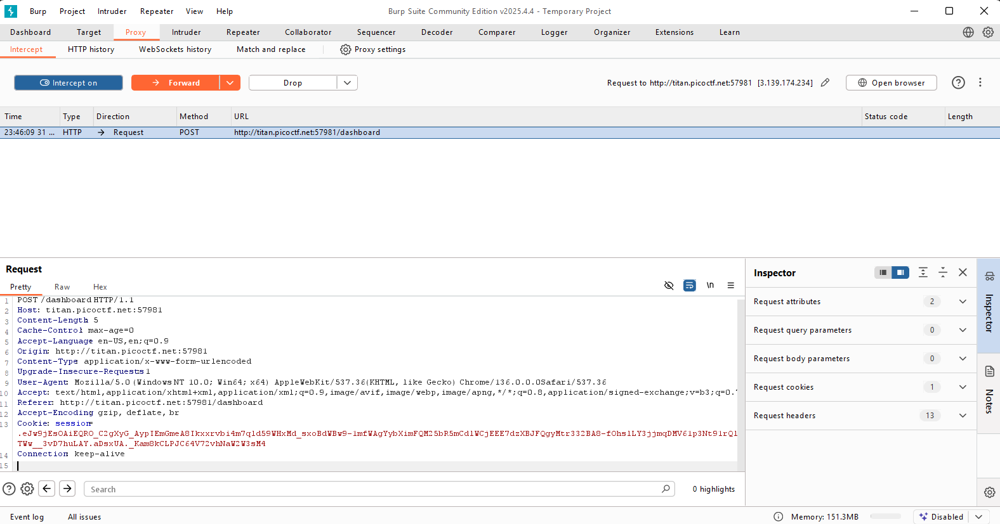
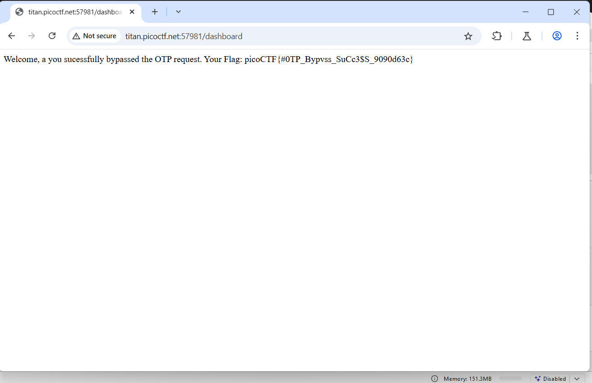

## How to solve

Desc:   Try here to find the flag

Hints 1: Try using burpsuite to intercept request to capture the flag.

Hints 2: Try mangling the request, maybe their server-side code doesn't handle malformed requests very well.

1. Buka burpsuite dan open browser

2. Jalankan udl challenge

3. Isikan form dan coba register

4. 

5. Dapat kita lihat bahwa semuanya berjalan lancar dan tidak ada sesuatu yang aneh

6. Kita akan coba intercept/menahan request dan mencoba mengedit request

7. 

8. Saya edit dan hapus bagian yang diblock lalu forward

9. Dan tidak terjadi apa apa juga

10. Kita akan coba intercept dan edit di bagian 2fa otp

11. 

12. Jika kita coba edit otpnya menjadi kosong...

13. 

14. Maka akan muncul invalid otp

15. Sekarang kita coba untuk menghapus keseluruhan otpnya

16. 

17. MAka kita akan mendapat flagnya

18. 