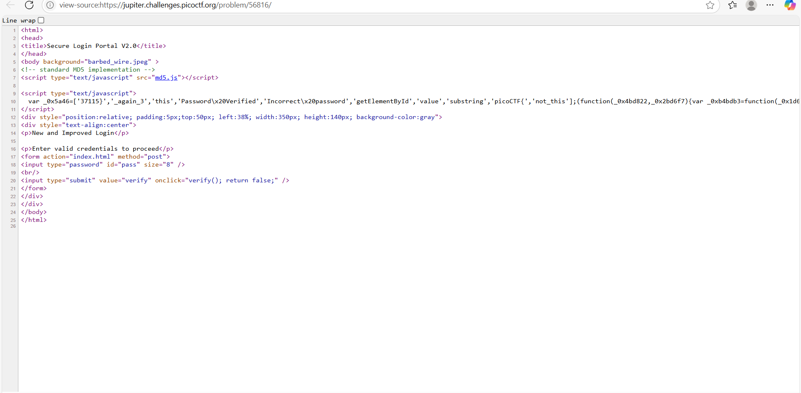
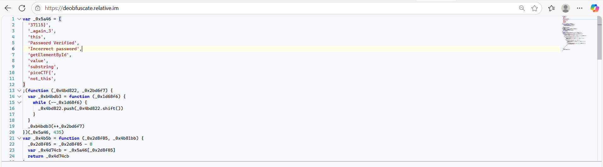

## How to solve

Desc: Can you break into this super secure portal? https://jupiter.challenges.picoctf.org/problem/56816/ (link) or http://jupiter.challenges.picoctf.org:56816

Hint 1: What is obfuscation?

1. Jika kita masuk ke url dan buka source pagenya maka akan ada script javascript untuk verifikasi passwordnya

2. 

3. Jika dilihat dari hint maka kita dapat dengan mudah mengetahui bahwa ini adalah javascript obfuscation

4. Kita dapat menggunakan tools online seperti https://deobfuscate.relative.im/ untuk deobfuscation

5. 

6. Setelah di-deobfuscation, dapat terlihat bahwa array _0x5a46 menyimpan beberapa string.

7. Array _0x5a46 menyimpan string yang akan digunakan pada proses dibawahnya, juga teks dengan format flag picoCTF

8. Jika kita susun dengan sedikit bruteforce, maka picoCTF{not_this_again_337115}
