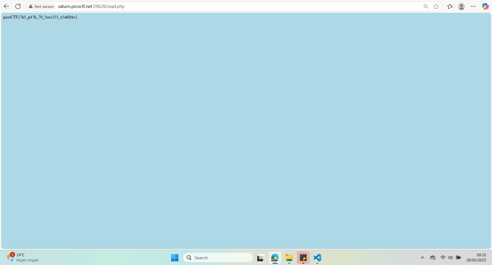

## How to solve

Desc: Can you get the flag?
We know that the website files live in /usr/share/nginx/html/ and the flag is at /flag.txt but the website is filtering absolute file paths. Can you get past the filter to read the flag?
Additional details will be available after launching your challenge instance.

Hint 1: 

1. Dari deskripsinya, seperti path traversal vurnerability

2. Kita dapat masukan command ../../../../ sesuai dengan /usr/share/nginx/html/ lalu karena flagnya berada di /flag.txt maka ../../../../flag.txt

3. 