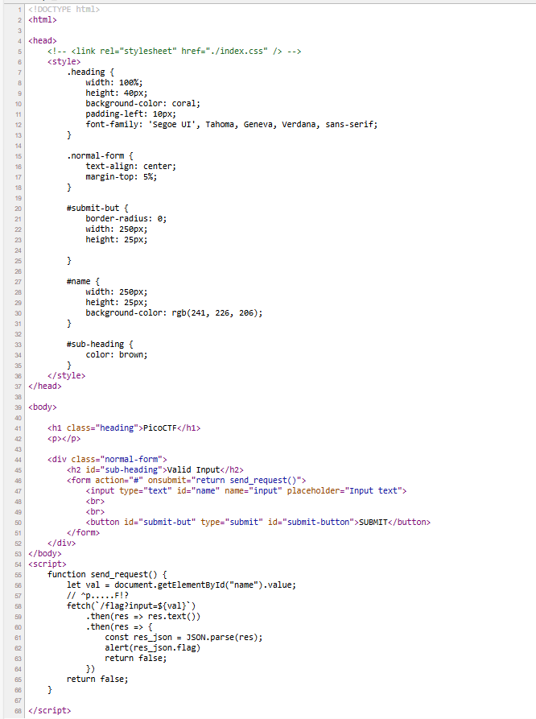
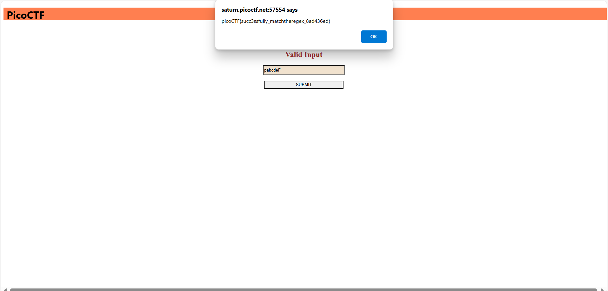

## How to solve

Desc: How about trying to match a regular expression
Additional details will be available after launching your challenge instance.

Hint 1: Access the webpage and try to match the regular expression associated with the text field

1. Diberi sebuah website berisi 1 form input

2. Jika kita lihat source codenya 

3. Terdapat sebuah script untuk DOM dengan id name, yaitu form input tadi

4. Sesuai dengan hint 1 kita diminta untuk mencocokan regexnya

5. "^p.....F!?" adalah regex-nya

6. Untuk melihat daftar regex character, dapat dilihat di https://www.rexegg.com/regex-quickstart.php

7.  ^ : Start of string or start of line
    p : Karakter p wajib muncul diawal
    ..... : 5 Karakter bebas
    F : Karakter huruf F
    !? : optional

8. Kita dapat inputkan "pabcdeF"

9. 
