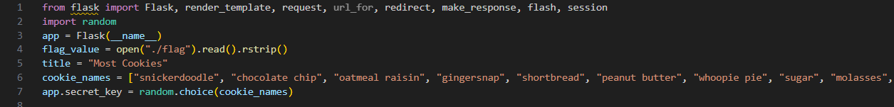
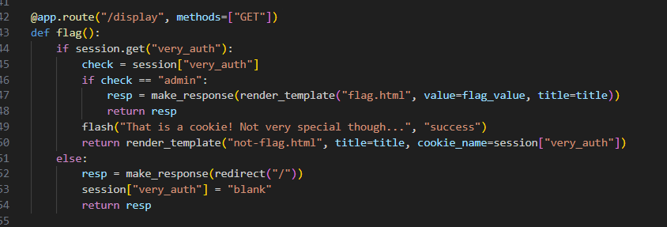
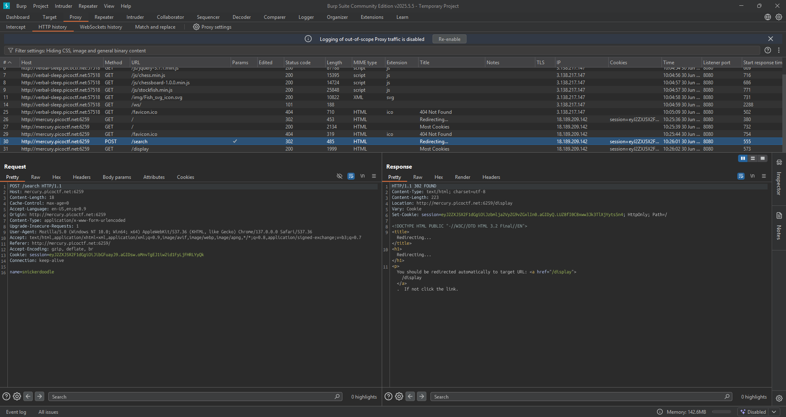
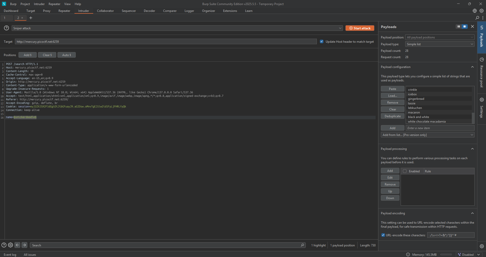
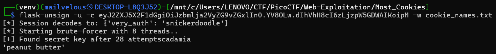
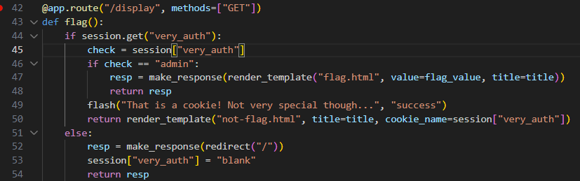

## How to solve

Desc: Alright, enough of using my own encryption. Flask session cookies should be plenty secure! server.py http://mercury.picoctf.net:6259/

Hint 1: How secure is a flask cookie?


1. Diberikan sebuah source code server.py

2. Secara sekilas dapat kita lihat bahwa daftar cookie disimpan dalam array cookie_names=[...] 

2. Kemudian menggunakan function random.choice(), cookie_names tadi diambil dan disimpan dalam variable app.secret_key

3. Jika dilihat secara sederhana kita dapat melakukan burteforcing daftar cookie tadi untuk mendapatkan session cookie yang digunakan admin 

4. Mengapa admin? karena hanya admin-lah yang punya akses kedalam flag.html, dimana flag disimpan sesuai dengan kode diatas

5. Dan jika kita mengirim request dengan menginputkan cookie "snickerdoodle", http requestnya seperti ini 

6. Kitaa dapat dengan mudah melakukan bruteforcing terhadap cookie_names tadi menggunakan fitur intruder di burpsuite

7. Kita masukkan seluruh cookie_names tadi kedalam payload configuration-simple list, lalu add position di nama cookienya seperti ini 

8. Start Attack

9. ...

10. Tidak jadi sepertinya, ada cara yang lebih mudah yaitu pake flask-unsign dengan template: flask-unsign --unsign --cookie 'session=...' --wordlist cookie_names.txt

11. Oh iya, masukkan list cookie tadi kedalam txtnya

12. 

13. Dapat kita lihat bahwa secret_key yang benar adalah 'peanut butter'

14. Jika kita lihat kembali ke kode kita dapat membuka flag.html jika very_auth itu berisi admin 

15. Maka kita buat cookie session baru dengan secret_key 'peanut butter' dan 'very_auth' = admin

    ```
    bash

        flask-unsign --sign --cookie '{"very_auth":"admin"}' --secret 'peanut butter'

    ```

16. Lalu ganti cookie session yang lama dan ke /display