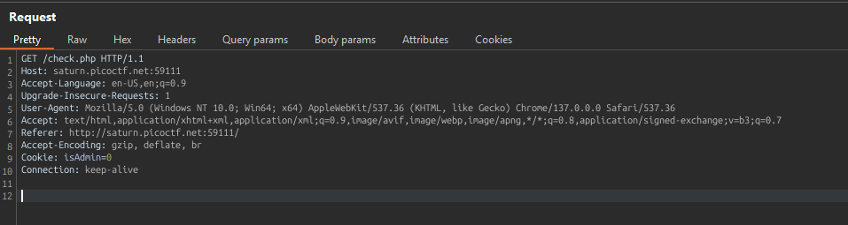

## How to solve

Desc: Can you get the flag?
Go to this website and see what you can discover.

Hint 1: Do you know how to modify cookies?


1. Jika kita klik 'Continue as guest'

2. Kita akan selalu menjadi guest

3. Jika kita source page-nya 

4. Function continueAsGuest() akan dijalankan setiap kita meng-klik button 'Continue as guest'

5. Sementara isi function-nya terdapat dalam script guest.js

6. 

     ``` bash

          function continueAsGuest()
          {
          window.location.href = '/check.php';
          document.cookie = "isAdmin=0";
          }

     ```

7. Mengirim cookie 'isAdmin=0'

8. Kita dapat mengubah isi cookienya dengan cara meng-interceptnya lewat burpsuite

9. Jalankan burpsuite dan jalankan intercept

10. 

11. Kita tinggal ubah http requestnya dari Cookie: isAdmin=0 menjadi isAdmin=1

12. 
