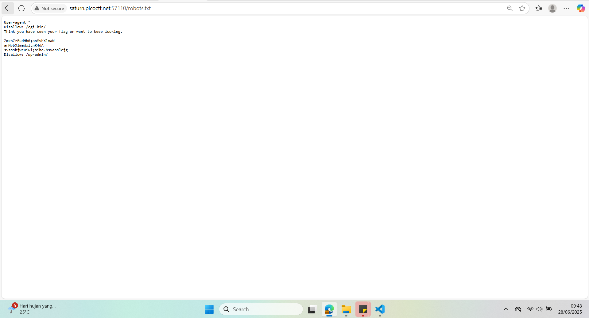
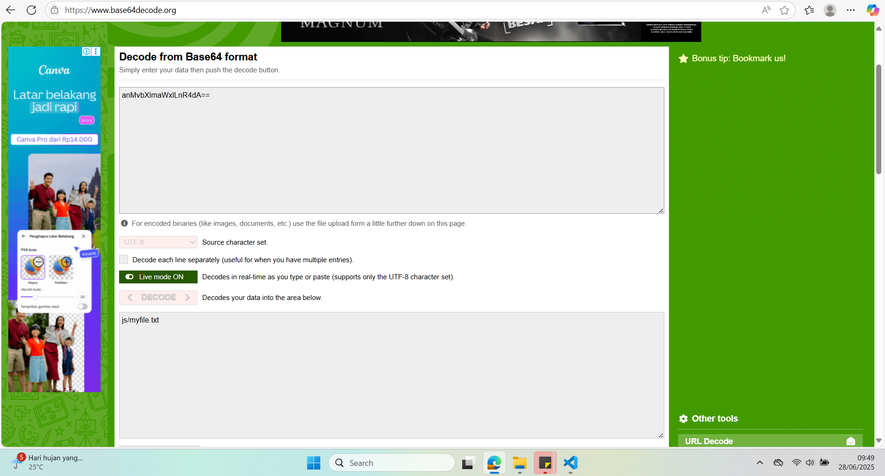
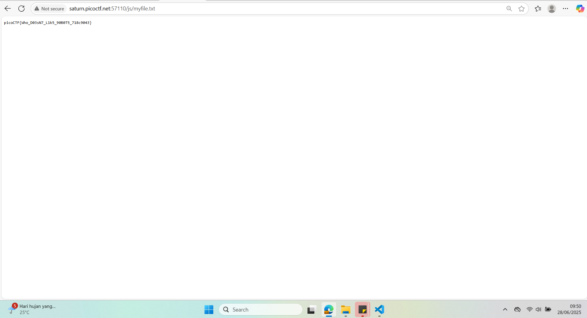

## How to solve

Desc: The flag is somewhere on this web application not necessarily on the website. Find it.
Check this out.

Hint 1: 

1. As always, firstly lets take a look at robots.txt

2. As you can see there is some text, look like base64 

3. Lets decode them 

4. Terdapat txt dalam directory js/

5. Jika kita masuk, kita dapatkan flagnya 

