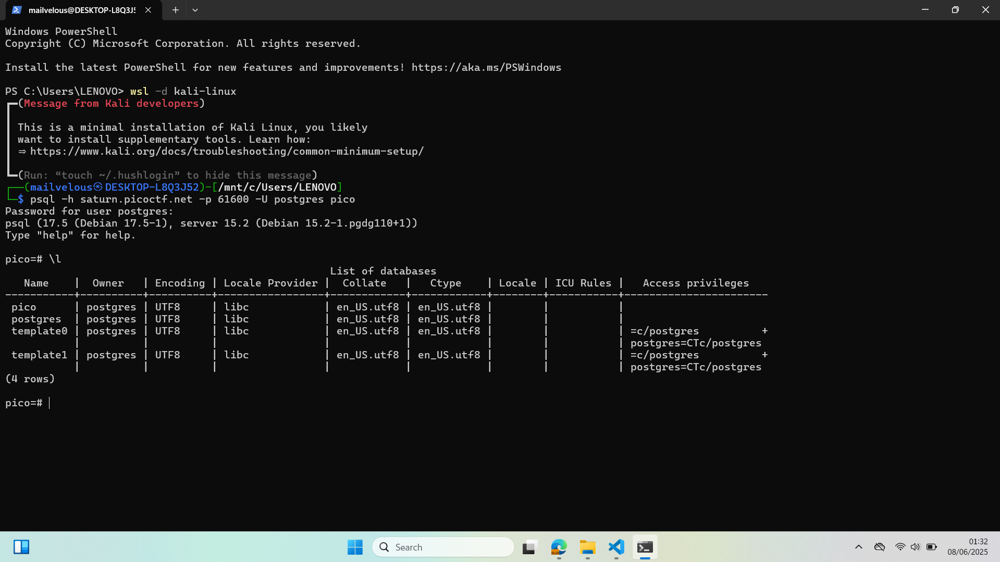
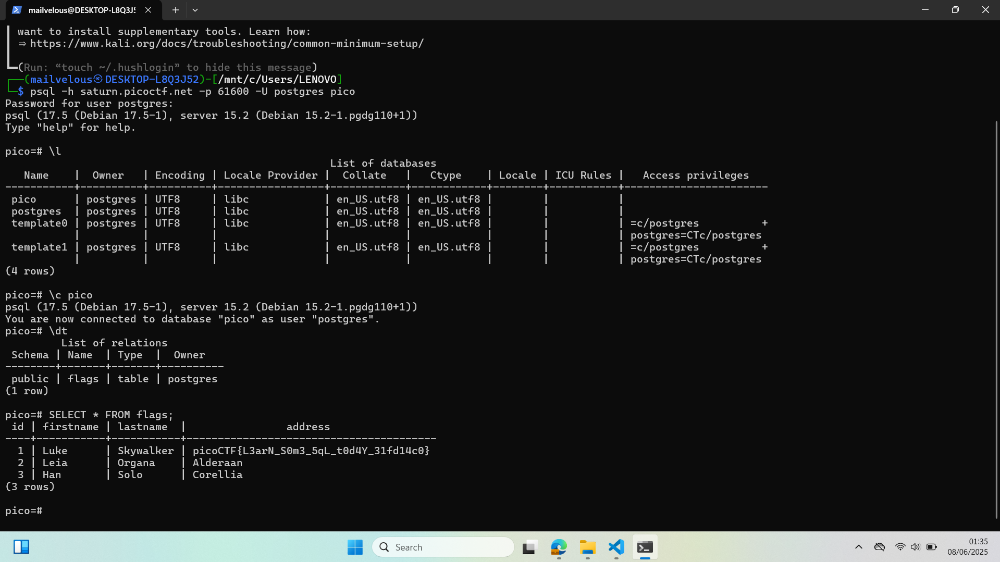

## How to solve

Desc: Connect to this PostgreSQL server and find the flag!
Additional details will be available after launching your challenge instance.

Hint 1: What does a SQL database contain?

1. Setelah masuk maka list seluruh database dengan \l

2. 

3. Lalu connect ke database pico dengan command "\c pico"

4. Lalu list seluruh table dengan command "\dt"

5. Dapat dilihat bahwa, terdapat table flags

6. Kita dapat menjalankan command sql sederhana "SELECT * FROM flags;" untuk melihat keseluruhan data tablenya

7. 
