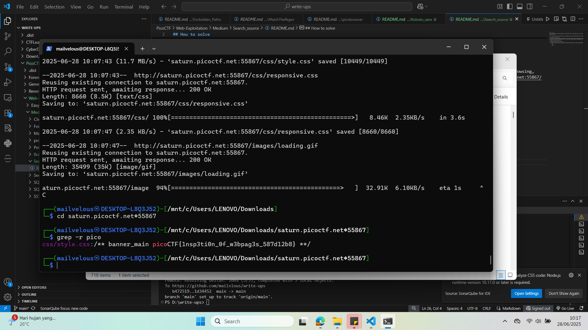
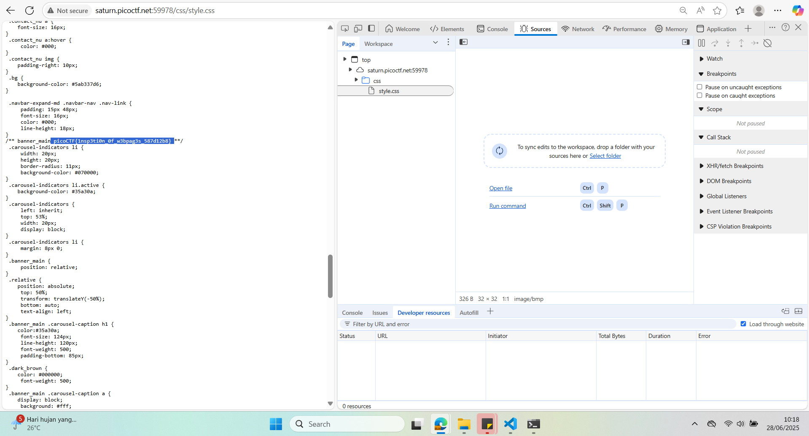

## How to solve

Desc: The developer of this website mistakenly left an important artifact in the website source, can you find it?
The website is here


Hint 1: How could you mirror the website on your local machine so you could use more powerful tools for searching?

1. Cek robots.txt tak ada apa apa

2. Dalam hint 1 "How could you mirror the website on your local machine so you could use more powerful tools for searching?" setelah saya browsing, kita dapat gunakan wget dengan command wget --mirror --convert-links --adjust-extension --page-requisites --no-parent http://saturn.picoctf.net:55867/

3. Masuk ke directory hasil wget tadi

4. Kemungkinan flag berada disana sesuai hint 1

5. Kita dapat gunakan command grep untuk mencarinya dan karena berada dalam directory, maka kita dapat gunakan command -r

    ``` bash

        wget -r 

    ```

6. 

7. Ternyata flagnya berada di css file 

