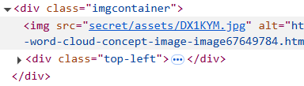
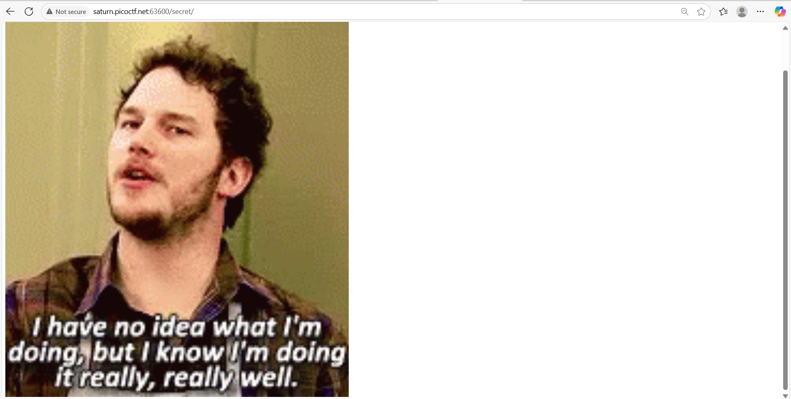
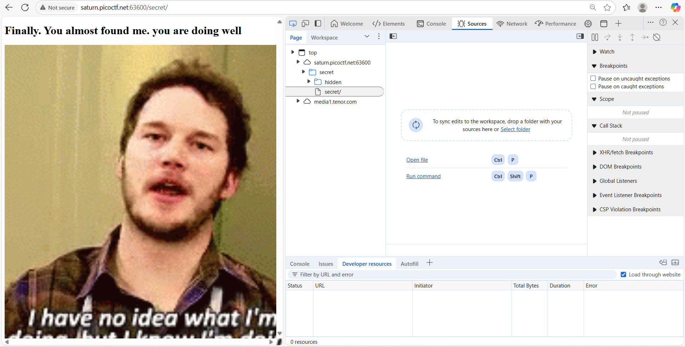
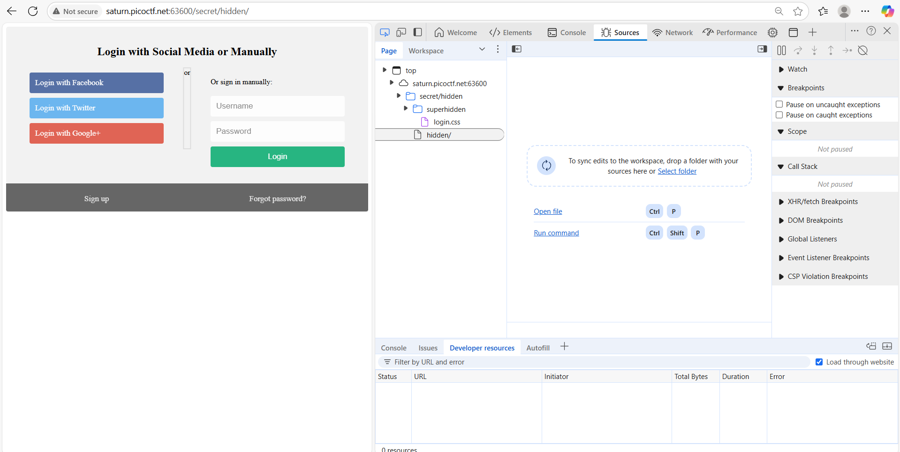
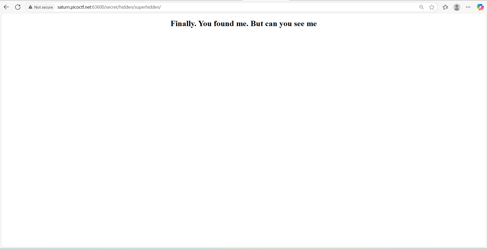
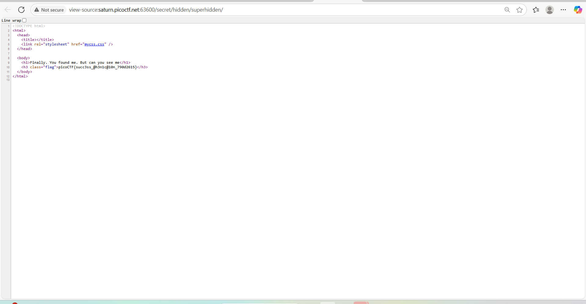

## How to solve

Desc: We have several pages hidden. Can you find the one with the flag?
The website is running here.

Hint 1: folders folders folders

1. Jika dilihat dari hint 1, flagnya kemungkinan disembunyikan dalam suatu folder tertentu

2. Saya coba lihat robots.txt namun tak ada apa apa karena untuk melihat websitenya kita perlu running instance dulu, artinya website ini tak terdeteksi oleh google semacamnya

3. Jika kita inspect element, kita dapat lihat gambar utamanya disimpan dalam directory tertentu 

4. Jika kita masuk ke directory secret/, maka 

5. Jika kita lihat sources maka dalam directory secret ada folder lagi yaitu hidden 

6. Sama, dalam hidden pun ada secret/hidden/superhidden/ 

7. Jika kita masuk ke secret/hidden/superhidden/ maka 

8. Tentu saja karena flagnya disimpan di komentar html 
