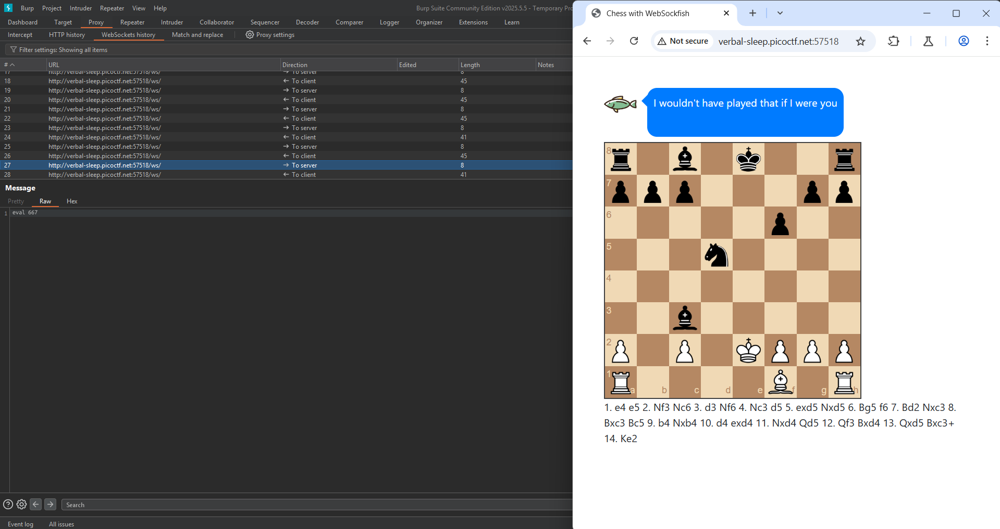

## How to solve

Desc: Can you win in a convincing manner against this chess bot? He won't go easy on you!
You can find the challenge here.

Hint 1: Try understanding the code and how the websocket client is interacting with the server

1. Ga jago catur jadi yah maapkeun :)

2. Kita mulai dari buka burpsuite

3. Berdasarkan dari hint 1 kemungkinan ini mengenai websocket vurnerability

4. Masuk ke-url dan pergi ke websocket history di burpsuite

5. Dapat kita lihat ketika saya mulai opening maka akan terlihat di websocket history 

6. 

7. 

8. 

9. Client memberikan respon yang berbeda beda

10. Dapat dilihat, ketika saya blunder dan bidak jumlahnya tidak seimbang 

11. Client memberikan respon dengan jumlah eval lebih besar 

12. Dapat dilihat ketika ratu saya mati 

13. Maka eval menjadi semakin tinggi, 667 

14. Dengan asumsi ini maka kita dapat menyimpulkan bahwa semakin tinggi nilai eval maka semakin mendekati kekalahan, semakin rendah maka client semakin mendekati kemenangan

15. Kita dapat coba menggunakan repeater untuk mengubah nilai eval menjadi negatif

16. 